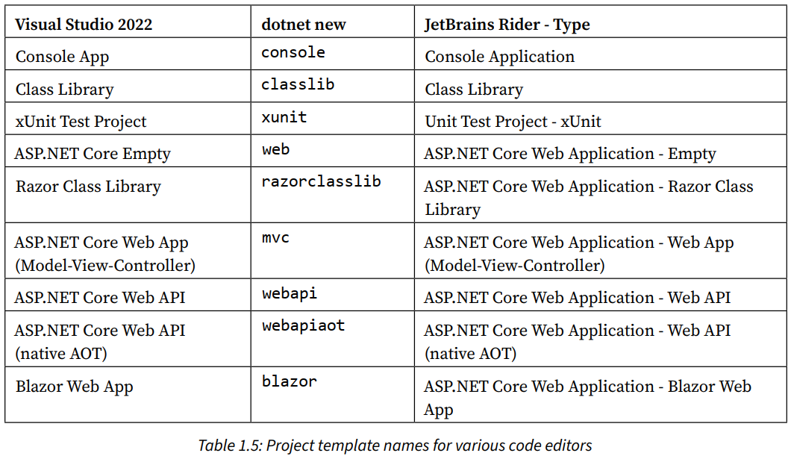
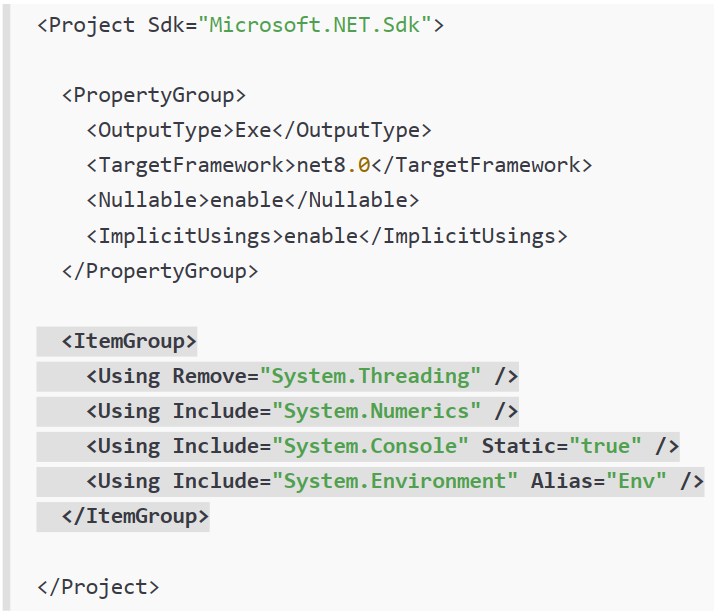
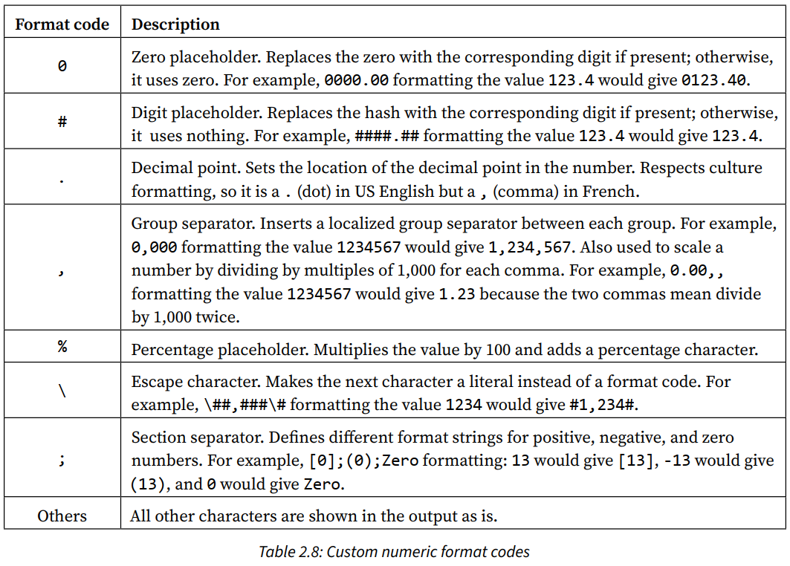
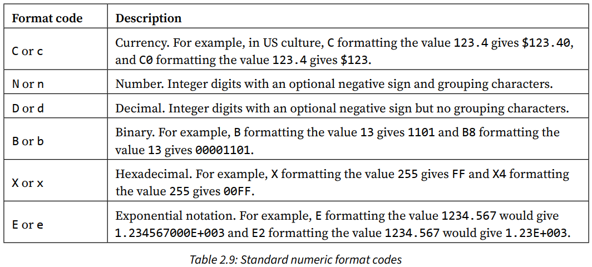

# Chapter 1: Hello, C#! Welcome, .NET!

## Setting up your development environment
### Visual Studio Code for cross-platform development
* It has strong support for web development, but weak support for mobile and desktop environments.
### Installing other extensions (Visual Studio Code)
```bash
code --install-extension ms-dotnettools.csdevkit
code --install-extension ms-dotnettools.dotnet-interactive-vscode
code --install-extension tintoy.msbuild-project-tools
code --install-extension humao.rest-client
code --install-extension icsharpcode.ilspy-vscode
```

## Understanding .NET
### Understanding intermediate language
* The **C# compiler (Roslyn)** converts source code into intermediate language (IL) code and stores it in an assembly (DLL or EXE).
* IL code statements are executed by **.NET's virtual machine (CoreCLR)**.
* The **just-in-time (JIT) compiler** compiles it into native CPU instructions.

## Building console apps using Visual Studio 2022
### Compiling and running code using Visual Studio
* Attaching a **debugger** requires **more resources**.
### Requirements for top-level programs
* There can be **only one** file like this in a project.
* Any classes or other types must be at the **bottom** of the file.

## Building console apps using Visual Studio Code
```bash
dotnet new sln --name Chapter01

# Targets your latest .NET SDK version by default.
# Use the -f or --framework switch to specify a target framework.
dotnet new console --output HelloCS

dotnet sln add HelloCS
```
### Notes
* dotnet CLI executes the app from the <projectname> folder.
* Visual Studio 2022 executes the app from the <projectname>\bin\Debug\net8.0 folder.
### Summary of other project types

* Summary of project template defaults, options, and switches: [🔗](https://github.com/markjprice/cs12dotnet8/blob/main/docs/ch01-project-options.md)

# Chapter 2: Speaking C#
## Discovering your C# compiler version
### Enabling a specific language version compiler
To use the improvements in a **C# point release** like 7.1, 7.2, or 7.3, you had to add a \<LangVersion> configuration element to the project file.
```xml
<LangVersion>7.3</LangVersion>
```

## Understanding C# grammar and vocabulary
### Comments
/* */ is useful for commenting in the middle of a statement.
```csharp
decimal totalPrice = subtotal /* for this item */ + salesTax;
```
### Implicitly and globally importing namespaces
* The `global using` keyword combination means you only need to import a namespace in one .cs file and it will be available throughout all .cs files.
* Use **.csproj** project file to control which namespaces are implicitly imported.

* Modify the project file to change what is included in the auto-generated class file.

## Working with variables
### Storing text
* Some letter needs two System.Char values to represent it. So, do not always assume one char equals one letter.
### Verbatim strings
* Prefix string with @ symbol to prevent escape character (\\) evaluation.
### Raw string literals
* Start and end with three or more double-quote characters.
```csharp
string xml = """
            <person age="50">
                <first_name>Mark</first_name>
            </person>
            """;
```
### Comparing double and decimal types
* Never compare double values using ==
* `decimal` stores the number as a large integer and shifts the decimal point.
### Storing dynamic types
* Its flexibility comes at the cost of performance.
* The value stored in the variable can have its members invoked without an explicit cast.
* Dynamic types are most useful when interoperating with non-.NET systems.
### Formatting using interpolated strings
* They can't be read from resource files to be localized.
## Exploring more about console apps
### Custom number formatting



### Simplifying the usage of the console
* using statement can be used to import a static class.
### Passing arguments to a console app
* Command-line arguments are seperated by **spaces**.
* To include spaces, enclose the argument value in **single or double quotes**.
