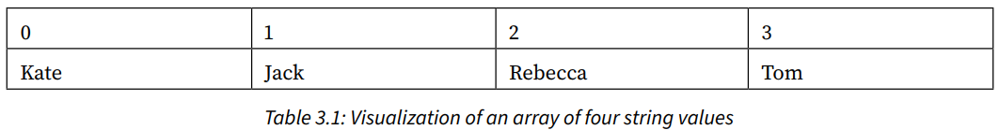
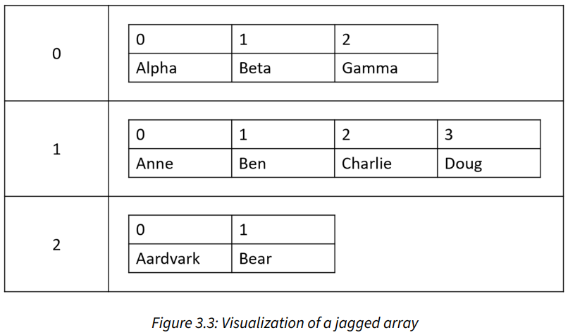
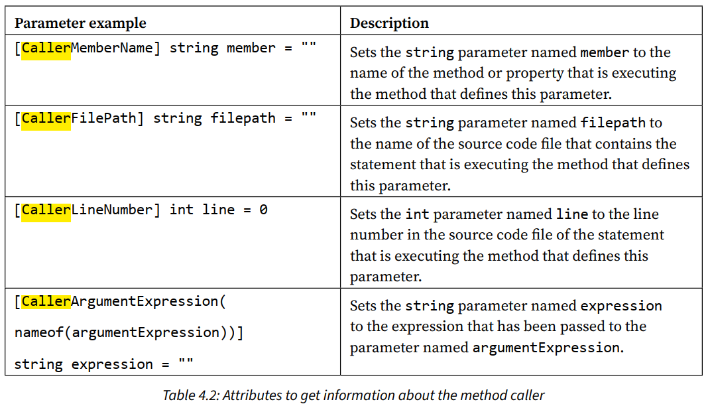

# Chapter 1: Hello, C#! Welcome, .NET!

## Setting up your development environment
### Visual Studio Code for cross-platform development
* It has strong support for web development, but weak support for mobile and desktop environments.
### Installing other extensions (Visual Studio Code)
```bash
code --install-extension ms-dotnettools.csdevkit
code --install-extension ms-dotnettools.dotnet-interactive-vscode
code --install-extension tintoy.msbuild-project-tools
code --install-extension humao.rest-client
code --install-extension icsharpcode.ilspy-vscode
```

## Understanding .NET
### Understanding intermediate language
* The **C# compiler (Roslyn)** converts source code into intermediate language (IL) code and stores it in an assembly (DLL or EXE).
* IL code statements are executed by **.NET's virtual machine (CoreCLR)**.
* The **just-in-time (JIT) compiler** compiles it into native CPU instructions.

## Building console apps using Visual Studio 2022
### Compiling and running code using Visual Studio
* Attaching a **debugger** requires **more resources**.
### Requirements for top-level programs
* There can be **only one** file like this in a project.
* Any classes or other types must be at the **bottom** of the file.

## Building console apps using Visual Studio Code
```bash
dotnet new sln --name Chapter01

# Targets your latest .NET SDK version by default.
# Use the -f or --framework switch to specify a target framework.
dotnet new console --output HelloCS

dotnet sln add HelloCS
```
### Notes
* dotnet CLI executes the app from the <projectname> folder.
* Visual Studio 2022 executes the app from the <projectname>\bin\Debug\net8.0 folder.
### Summary of other project types

* Summary of project template defaults, options, and switches: [🔗](https://github.com/markjprice/cs12dotnet8/blob/main/docs/ch01-project-options.md)

## Explore topics
* Learn more: [🔗](https://github.com/markjprice/cs12dotnet8/blob/main/docs/book-links.md#chapter-1---hello-c-welcome-net)

# Chapter 2: Speaking C#
## Discovering your C# compiler version
### Enabling a specific language version compiler
To use the improvements in a **C# point release** like 7.1, 7.2, or 7.3, you had to add a \<LangVersion> configuration element to the project file.
```xml
<LangVersion>7.3</LangVersion>
```

## Understanding C# grammar and vocabulary
### Comments
/* */ is useful for commenting in the middle of a statement.
```csharp
decimal totalPrice = subtotal /* for this item */ + salesTax;
```
### Implicitly and globally importing namespaces
* The `global using` keyword combination means you only need to import a namespace in one .cs file and it will be available throughout all .cs files.
* Use **.csproj** project file to control which namespaces are implicitly imported.

* Modify the project file to change what is included in the auto-generated class file.

## Working with variables
### Storing text
* Some letter needs two System.Char values to represent it. So, do not always assume one char equals one letter.
### Verbatim strings
* Prefix string with @ symbol to prevent escape character (\\) evaluation.
### Raw string literals
* Start and end with three or more double-quote characters.
```csharp
string xml = """
            <person age="50">
                <first_name>Mark</first_name>
            </person>
            """;
```
### Comparing double and decimal types
* Never compare double values using ==
* `decimal` stores the number as a large integer and shifts the decimal point.
### Storing dynamic types
* Its flexibility comes at the cost of performance.
* The value stored in the variable can have its members invoked without an explicit cast.
* Dynamic types are most useful when interoperating with non-.NET systems.
### Formatting using interpolated strings
* They can't be read from resource files to be localized.

## Exploring more about console apps
### Custom number formatting


### Simplifying the usage of the console
* using statement can be used to import a static class.
### Passing arguments to a console app
* Command-line arguments are seperated by **spaces**.
* To include spaces, enclose the argument value in **single or double quotes**.

## Explore topics
* Learn more: [🔗](https://github.com/markjprice/cs12dotnet8/blob/main/docs/book-links.md#chapter-2---speaking-c)

# Chapter 3: Controlling Flow, Converting Types, and Handling Exceptions
## Operating on variables
### Exploring unary operators
```csharp
int a = 3;
// The ++ operator executes after the assignment (aka postfix operator).
int b = a++; // b is 3
```
* **Good Practice:** Never combine the use of the ++ and -- operators with an assignement operator, =. Perform the operations as separate statements.
### Exploring logical operators (&, |, ^)
* Operate on **Boolean** values.
* For the **XOR ^** logical operator, either operand can be true **(but not both)** for the result to be true.
### Exploring conditional logical operators (&&, ||)
* **Good Practice:** It is safest to avoid conditional logical operators when used in combination with functions that cause side effects.
### Exploring bitwise and binary shift operators (&, |, <<, >>)
* Binary shift operators **(<<, >>)** can perform some common arithmetic calculations (e.g. x * 2, x / 2) much faster than traditional operators.

## Understanding selection statements
### Pattern matching with the if statement
* The `if` statement can use the `is` **keyword** in combination with declaring a local variable.
```csharp
object o = 3;

if (o is int i)
{
    // ...
}
```
### Branching with the switch statement
* **Good Practice:** The `goto` keyword can be a good solution to code logic in some scenarios. But, you **should use it sparingly**.
### Pattern matching with the switch statement
* The `switch` statement supports pattern matching.
```csharp
switch(animal)
{
    // case Cat fourLeggedCat when fourLeggedCat.Legs == 4:

    // Alternative: A more concise pattern-matching syntax.
    case Cat { Legs: 4 } fourLeggedCat:
        // ...
        break;
    case Spider spider:
        // ...
        break;
    default:
        // ...
        break;
}
```
### Simplifying switch statements with switch expressions
* Switch expressions can be used where **all cases return a value to set a single variables**. It uses a **lambda**, **=>**, to indicate a **return value**.

## Understanding iteration statements
### Looping with the foreach statement
* If the sequence structure of the `foreach` statement is modified during iteration, for example, by adding or removing an item, then **an exception will be thrown**.
### Understanding how foreach works internally
* `foreach` statement will work on any type that implements `IEnumerable` interface.

## Storing multiple values in an array
### Working with single-dimensional arrays

* Arrays are always of a fixed size at the time of memory allocation.
### Working with multi-dimensional arrays

* To store **a grid of values**.
* Helpful methods that can discover the lower and upper bounds.
* You can use a `foreach` statement to enumerate all the items in a multi-dimensional array.
```csharp
// To get the first index of the first dimension.
int firstIndex = mdArray.GetLowerBound(0);
// To get the last index of the first dimension.
int lastIndex = mdArray.GetUpperBound(0);
```
### Working with jagged arrays

* Use jagged arrays (aka **array of arrays**, e.g. `jagged[][]`) when the number of items stored in each dimension is different.
### List pattern matching with arrays

### Summarizing arrays
* **Arrays** are useful for **temporarily** storing multiple items. **Collections** are more **flexible** option when adding and removing items dynamically.
* Any sequence of items can convert into an array using the `ToArray` extension method.

## Casting and converting between types
### How negative numbers are represented in binary
* Negative aka signed numbers use the **first bit** to represent negativity.
### Converting with the System.Convert type
* An alternative to using the cast operator is to use the `System.Convert` type.
```csharp
double g = 9.8;
// int h = (int)g; // Using the cast operator.
int h = Convert.ToInt32(g); // Using the System.Convert.
```
* Important differences betweem casting and converting:
    * Converting rounds the double value 9.8 up to 10 instead of trimming the part after the decimal point.
    * Casting can allow overflows while converting will throw an exception.
### Rounding numbers and the default rounding rules
* **System.Convert**'s rounding rule is the **Banker's rounding**. This rule reduces bias by alternating when it rounds toward or away from zero.
### Converting from a binary object to a string
* **Base64** encoding is used to represent binary object (e.g. image, video) in a text-based format.
### Parsing from strings to numbers or dates and times
* The opposite of `ToString` is `Parse`.
* **Good Practice:** Use the standard date and time format specifiers: [🔗](https://learn.microsoft.com/en-us/dotnet/standard/base-types/standard-date-and-time-format-strings#table-of-format-specifiers)

## Checking for overflow
### Throwing overflow exceptions with the checked statement
* `checked` statement tells .NET to **throw an exception** when an overflow happens.
* `checked` statement is used to change the default overflow behavior at **runtime**.
### Disabling compiler overflow checks with the unchecked statement
* `unchecked` statement is used to change the default overflow behavior at **compile-time**.

## Explore topics
* Learn more: [🔗](https://github.com/markjprice/cs12dotnet8/blob/main/docs/book-links.md#chapter-3---controlling-flow-converting-types-and-handling-exceptions)

# Chapter 4: Writing, Debugging, and Testing Functions
## Writing functions
### What is automatically generated for a local function?
* Local functions have limitations, like they **cannot have XML comments** to document them.
### What is automatically generated for a static function?
* When you use a separate file to define a `partial Program` class with `static` functions, the compiler merges your function as a memnber of the `Program` class **at the same level as** the \<Main>$method.
### A brief aside about arguments and parameters
* **Parameter** is a **variable** in a function definition.
* **Argument** is the **data** you pass into the method's parameters.
### Documenting functions with XML comments
* This feature is **primarily** designed to be used with a tool that converts the comments into documentation, like **Sandcastle**.

## Hot reloading during development
### Hot reloading using Visual Studio Code and dotnet watch
```bash
# Command to activate Hot Reload.
dotnet watch [run]
```

## Logging during development and runtime
### Understanding logging options
* **Common logging frameworks:** Apache log4net, NLog, **Serilog**
### Instrumenting with Debug and Trace
* `Debug` class is used to add loggging that gets written only during **development**.
* `Trace` class is used to add loggging that gets written during **both development and runtime**.
* `Debug` and `Trace` classes write to any trace listener.
* Trace listener is a type that can be configured to write output anywhere you like.
### Configuring trace listeners
```bash
# With the Debug configuration, both Debug and Trace are active and will write to any trace listeners.
# With the Release configuration, only Trace will write to any trace listeners.
dotnet run --configuration (Debug|Release)
```
### Adding packages to a project in Visual Studio Code
```bash
# Add a reference to a NuGet package to your project file.
dotnet add package <PACKAGE_NAME>

# Add a project-to-project reference to your project file.
dotnet add reference <PROJECT_NAME>
```
### Logging information about your source code
* In C# 10 and later, you can get more logging information from the compiler by decorating function parameters with special attributes.


## Unit testing
* **xUnit** is more extensible and has better community support.

## Throwing and catching exceptions in functions
* You should only catch and handle an exception if you have enough information to mitigate the issue.
### Throwing exceptions using guard clauses

### Rethrowing exceptions
* 3 ways to rethrow:
    1. `throw`
    2. `throw ex` - This is **usually poor practice**, but can be useful when you want to deliberately remove that information when it contains sensitive data.
    3. throw a new exception, and pass the caught exception as the `innerException` parameter.

## Explore topic
* Learn more: [🔗](https://github.com/markjprice/cs12dotnet8/blob/main/docs/book-links.md#chapter-4---writing-debugging-and-testing-functions)

# Chapter 5: Building Your Own Types with Object-Oriented Programming
## Building class libraries
### Creating a class library
* Although we can use a newer C# 12 compiler on older frameworks, some modern compiler features require a modern .NET runtime. For example, we cannot use default implementations in an interface and the `required` keyword (needs an attribute introduced in .NET 7).
* By default, targeting .NET Standard 2.0 uses the C# 7 compiler, but this can be overriden.
### Understanding type access modifier
* **Good Practice:** Always **explicitly specify** the access modifier for a class.
* The **default** access modifier for a type is `internal`.
### Instantiating a class
* `new` keyword allocates memory for the object and initializes any internal data.

## Storing data in fields
### Member access modifiers

* The **default** access modifier for members is `private`.
* **Good Practice:** Explicitly apply one of the access modifiers to all type members. Fields should usually be `private` or `protected`, and you should then create `public` properties to get or set the field values.
### Storing multiple values using an enum type
* We can combine multiple choices into a single value using `enum` flags.
* Use the | operator (the bitwise logical OR) to combine the `enum` values.
### Making a field static
* Fields, constructors, methods, properties and other members can all be static.
### Making a field constant
* Constants are not always the best choice.
* It must be expressible as a literal string, Boolean, or number value.
* It is replaced with the literal value at compile time, which will, therefore, not be reflected if the value changes in a future version.
### Making a field read-only
* A better choice for fields that should not change is to mark them as read-only.
* Use read-only fields over constant fields.
* It can be expressed using any executable statement.
* It is a live reference.
### Requiring fields to be set during instantiation
* Setting a property or field to be required does not mean that it cannot be null. It just means that it must be explicitly set to null.

## Working with methods and tuples
### Naming parameter values when calling methods
* Use named parameters to skip over optional parameters.
### Controlling how parameters are passed
* By value (**default**): in-only.
* `out` parameter: out-only. They must be set inside the method.
* `ref` parameter (By reference): in-and-out.
* `in` parameter: Think of these as being a reference parameter that is *read-only*.
### Aliasing tuples
```csharp
// Use the title case naming convention for tuple's parameters.
using Fruit = (string Name, int Number);
```
### Splitting classes using partial
* E.g. split the class into an autogenerated code file and a manually edited code file.

## Controlling access with properties and indexers
* A property is simply a method.
### Defining indexers
* Use the array syntax to access a property.
* Indexers can be overloaded.
```csharp
public Person this[int index]
{
    get
    {
        return Children[index];
    }
    set
    {
        Children[index] = value;
    }
}
```

## Working with record types
### Init-only properties
* Use the `init` keyword to make a property immutable. It can be used in place of the `set` keyword in a property definition.
### Defining record types
* Record types are defined by using the `record` keyword.
* It makes the whole object **immutable**.
* It **acts like a value** when compared.
* To change any state after instantiation, you create new records from existing ones using the `with` keyowrd.
```csharp
ImmutableVehicle repaintedCar = car with
{
    Color = "Polymetal Grey Metallic"
};
```
### Positional data members in records
```csharp
// Simpler syntax to define a record that auto-generates the
// properties, constructor, and deconstructor.
public record ImmutableAnimal(string Name, string Species);
```
### Defining a primary constructor for a class
* Parameters of a class type with a primary constructor don't become public properties automatically.
```csharp
public class Headset(string manufacturer, string productName)
{
    public string Manufacturer { get; set; } = manufacturer;
    public string ProductName { get; set; } = productName;

    // Default parameterless constructor calls the primary constructor.
    public Headset() : this("Microsoft", "HoloLens") { }
}
```
