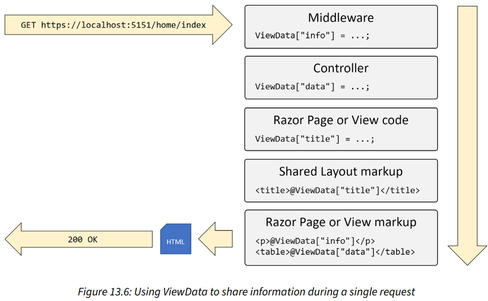

# Chapter 1: Hello, C#! Welcome, .NET!

## Setting up your development environment

### Visual Studio Code for cross-platform development

- It has strong support for web development, but weak support for mobile and desktop environments.

### Installing other extensions (Visual Studio Code)

```bash
code --install-extension ms-dotnettools.csdevkit
code --install-extension ms-dotnettools.dotnet-interactive-vscode
code --install-extension tintoy.msbuild-project-tools
code --install-extension humao.rest-client
code --install-extension icsharpcode.ilspy-vscode
```

## Understanding .NET

### Listing and removing versions of .NET

```bash
dotnet --list-sdks
dotnet --list-runtimes
dotnet --info
```

- On Windows, use the **Apps & features** to remove .NET SDKs.
- On Linux: [🔗](https://learn.microsoft.com/en-us/dotnet/core/install/remove-runtime-sdk-versions?pivots=os-linux)

### Understanding intermediate language

- The **C# compiler (Roslyn)** converts source code into intermediate language (IL) code and stores it in an assembly (DLL or EXE).
- IL code statements are executed by **.NET's virtual machine (CoreCLR)**.
- The **just-in-time (JIT) compiler** compiles it into native CPU instructions.

## Building console apps using Visual Studio 2022

### Compiling and running code using Visual Studio

- Attaching a **debugger** requires **more resources**.

### Requirements for top-level programs

- There can be **only one** file like this in a project.
- Any classes or other types must be at the **bottom** of the file.

## Building console apps using Visual Studio Code

```bash
dotnet new sln --name Chapter01

# Targets your latest .NET SDK version by default.
# Use the -f or --framework switch to specify a target framework.
dotnet new console --output HelloCS

dotnet sln add HelloCS
```

### Notes

- dotnet CLI executes the app from the <projectname> folder.
- Visual Studio 2022 executes the app from the <projectname>\bin\Debug\net8.0 folder.

### Summary of other project types


- Summary of project template defaults, options, and switches: [🔗](https://githu6.com/markjprice/cs12dotnet8/blob/main/docs/ch01-project-options.md)

## Practicing and exploring

### Explore topics

- Learn more: [🔗](https://github.com/markjprice/cs12dotnet8/blob/main/docs/book-links.md#chapter-1---hello-c-welcome-net)

# Chapter 2: Speaking C#

## Discovering your C# compiler version

### Enabling a specific language version compiler

To use the improvements in a **C# point release** like 7.1, 7.2, or 7.3, you had to add a \<LangVersion> configuration element to the project file.

```xml
<LangVersion>7.3</LangVersion>
```

## Understanding C# grammar and vocabulary

### Comments

/\* \*/ is useful for commenting in the middle of a statement.

```csharp
decimal totalPrice = subtotal /* for this item */ + salesTax;
```

### Implicitly and globally importing namespaces

- The `global using` keyword combination means you only need to import a namespace in one .cs file and it will be available throughout all .cs files.
- Use **.csproj** project file to control which namespaces are implicitly imported.
  
- Modify the project file to change what is included in the auto-generated class file.

## Working with variables

### Storing text

- Some letter needs two System.Char values to represent it. So, do not always assume one char equals one letter.

### Verbatim strings

- Prefix string with @ symbol to prevent escape character (\\) evaluation.

### Raw string literals

- Start and end with three or more double-quote characters.

```csharp
string xml = """
            <person age="50">
                <first_name>Mark</first_name>
            </person>
            """;
```

### Comparing double and decimal types

- Never compare double values using ==
- `decimal` stores the number as a large integer and shifts the decimal point.

### Storing dynamic types

- Its flexibility comes at the cost of performance.
- The value stored in the variable can have its members invoked without an explicit cast.
- Dynamic types are most useful when interoperating with non-.NET systems.

### Formatting using interpolated strings

- They can't be read from resource files to be localized.

## Exploring more about console apps

### Custom number formatting


### Simplifying the usage of the console

- using statement can be used to import a static class.

### Passing arguments to a console app

- Command-line arguments are separated by **spaces**.
- To include spaces, enclose the argument value in **single or double quotes**.

## Practicing and exploring

### Explore topics

- Learn more: [🔗](https://github.com/markjprice/cs12dotnet8/blob/main/docs/book-links.md#chapter-2---speaking-c)

# Chapter 3: Controlling Flow, Converting Types, and Handling Exceptions

## Operating on variables

### Exploring unary operators

```csharp
int a = 3;
// The ++ operator executes after the assignment (aka postfix operator).
int b = a++; // b is 3
```

- **Good Practice:** Never combine the use of the ++ and -- operators with an assignment operator, =. Perform the operations as separate statements.

### Exploring logical operators (&, |, ^)

- Operate on **Boolean** values.
- For the **XOR ^** logical operator, either operand can be true **(but not both)** for the result to be true.

### Exploring conditional logical operators (&&, ||)

- **Good Practice:** It is safest to avoid conditional logical operators when used in combination with functions that cause side effects.

### Exploring bitwise and binary shift operators (&, |, <<, >>)

- Binary shift operators **(<<, >>)** can perform some common arithmetic calculations (e.g. x \* 2, x / 2) much faster than traditional operators.

## Understanding selection statements

### Pattern matching with the if statement

- The `if` statement can use the `is` **keyword** in combination with declaring a local variable.

```csharp
object o = 3;

if (o is int i)
{
    // ...
}
```

### Branching with the switch statement

- **Good Practice:** The `goto` keyword can be a good solution to code logic in some scenarios. But, you **should use it sparingly**.

### Pattern matching with the switch statement

- The `switch` statement supports pattern matching.

```csharp
switch(animal)
{
    // case Cat fourLeggedCat when fourLeggedCat.Legs == 4:

    // Alternative: A more concise pattern-matching syntax.
    case Cat { Legs: 4 } fourLeggedCat:
        // ...
        break;
    case Spider spider:
        // ...
        break;
    default:
        // ...
        break;
}
```

### Simplifying switch statements with switch expressions

- Switch expressions can be used where **all cases return a value to set a single variables**. It uses a **lambda**, **=>**, to indicate a **return value**.

## Understanding iteration statements

### Looping with the foreach statement

- If the sequence structure of the `foreach` statement is modified during iteration, for example, by adding or removing an item, then **an exception will be thrown**.

### Understanding how foreach works internally

- `foreach` statement will work on any type that implements `IEnumerable` interface.

## Storing multiple values in an array

### Working with single-dimensional arrays


- Arrays are always of a fixed size at the time of memory allocation.

### Working with multi-dimensional arrays


- To store **a grid of values**.
- Helpful methods that can discover the lower and upper bounds.
- You can use a `foreach` statement to enumerate all the items in a multi-dimensional array.

```csharp
// To get the first index of the first dimension.
int firstIndex = mdArray.GetLowerBound(0);
// To get the last index of the first dimension.
int lastIndex = mdArray.GetUpperBound(0);
```

### Working with jagged arrays


- Use jagged arrays (aka **array of arrays**, e.g. `jagged[][]`) when the number of items stored in each dimension is different.

### List pattern matching with arrays


### Summarizing arrays

- **Arrays** are useful for **temporarily** storing multiple items. **Collections** are more **flexible** option when adding and removing items dynamically.
- Any sequence of items can convert into an array using the `ToArray` extension method.

## Casting and converting between types

### How negative numbers are represented in binary

- Negative aka signed numbers use the **first bit** to represent negativity.

### Converting with the System.Convert type

- An alternative to using the cast operator is to use the `System.Convert` type.

```csharp
double g = 9.8;
// int h = (int)g; // Using the cast operator.
int h = Convert.ToInt32(g); // Using the System.Convert.
```

- Important differences between casting and converting:
  - Converting rounds the double value 9.8 up to 10 instead of trimming the part after the decimal point.
  - Casting can allow overflows while converting will throw an exception.

### Rounding numbers and the default rounding rules

- **System.Convert**'s rounding rule is the **Banker's rounding**. This rule reduces bias by alternating when it rounds toward or away from zero.

### Converting from a binary object to a string

- **Base64** encoding is used to represent binary object (e.g. image, video) in a text-based format.

### Parsing from strings to numbers or dates and times

- The opposite of `ToString` is `Parse`.
- **Good Practice:** Use the standard date and time format specifiers: [🔗](https://learn.microsoft.com/en-us/dotnet/standard/base-types/standard-date-and-time-format-strings#table-of-format-specifiers)

## Checking for overflow

### Throwing overflow exceptions with the checked statement

- `checked` statement tells .NET to **throw an exception** when an overflow happens.
- `checked` statement is used to change the default overflow behavior at **runtime**.

### Disabling compiler overflow checks with the unchecked statement

- `unchecked` statement is used to change the default overflow behavior at **compile-time**.

## Practicing and exploring

### Explore topics

- Learn more: [🔗](https://github.com/markjprice/cs12dotnet8/blob/main/docs/book-links.md#chapter-3---controlling-flow-converting-types-and-handling-exceptions)

# Chapter 4: Writing, Debugging, and Testing Functions

## Writing functions

### What is automatically generated for a local function?

- Local functions have limitations, like they **cannot have XML comments** to document them.

### What is automatically generated for a static function?

- When you use a separate file to define a `partial Program` class with `static` functions, the compiler merges your function as a member of the `Program` class **at the same level as** the \<Main>$method.

### A brief aside about arguments and parameters

- **Parameter** is a **variable** in a function definition.
- **Argument** is the **data** you pass into the method's parameters.

### Documenting functions with XML comments

- This feature is **primarily** designed to be used with a tool that converts the comments into documentation, like **Sandcastle**.

## Hot reloading during development

### Hot reloading using Visual Studio Code and dotnet watch

```bash
# Command to activate Hot Reload.
dotnet watch [run]
```

## Logging during development and runtime

### Understanding logging options

- **Common logging frameworks:** Apache log4net, NLog, **Serilog**

### Instrumenting with Debug and Trace

- `Debug` class is used to add logging that gets written only during **development**.
- `Trace` class is used to add logging that gets written during **both development and runtime**.
- `Debug` and `Trace` classes write to any trace listener.
- Trace listener is a type that can be configured to write output anywhere you like.

### Configuring trace listeners

```bash
# With the Debug configuration, both Debug and Trace are active and will write to any trace listeners.
# With the Release configuration, only Trace will write to any trace listeners.
dotnet run --configuration (Debug|Release)
```

### Adding packages to a project in Visual Studio Code

```bash
# Add a reference to a NuGet package to your project file.
dotnet add package <PACKAGE_NAME>

# Add a project-to-project reference to your project file.
dotnet add reference <PROJECT_NAME>
```

### Logging information about your source code

- In C# 10 and later, you can get more logging information from the compiler by decorating function parameters with special attributes.
  

## Unit testing

- **xUnit** is more extensible and has better community support.

## Throwing and catching exceptions in functions

- You should only catch and handle an exception if you have enough information to mitigate the issue.

### Throwing exceptions using guard clauses


### Rethrowing exceptions

- 3 ways to rethrow:
  1. `throw`
  2. `throw ex` - This is **usually poor practice**, but can be useful when you want to deliberately remove that information when it contains sensitive data.
  3. throw a new exception, and pass the caught exception as the `innerException` parameter.

## Practicing and exploring

### Explore topic

- Learn more: [🔗](https://github.com/markjprice/cs12dotnet8/blob/main/docs/book-links.md#chapter-4---writing-debugging-and-testing-functions)

# Chapter 5: Building Your Own Types with Object-Oriented Programming

## Building class libraries

### Creating a class library

- Although we can use a newer C# 12 compiler on older frameworks, some modern compiler features require a modern .NET runtime. For example, we cannot use default implementations in an interface and the `required` keyword (needs an attribute introduced in .NET 7).
- By default, targeting .NET Standard 2.0 uses the C# 7 compiler, but this can be overriden.

### Understanding type access modifier

- **Good Practice:** Always **explicitly specify** the access modifier for a class.
- The **default** access modifier for a type is `internal`.

### Instantiating a class

- `new` keyword allocates memory for the object and initializes any internal data.

## Storing data in fields

### Member access modifiers


- The **default** access modifier for members is `private`.
- **Good Practice:** Explicitly apply one of the access modifiers to all type members. Fields should usually be `private` or `protected`, and you should then create `public` properties to get or set the field values.

### Storing multiple values using an enum type

- We can combine multiple choices into a single value using `enum` flags.
- Use the | operator (the bitwise logical OR) to combine the `enum` values.

### Making a field static

- Fields, constructors, methods, properties and other members can all be static.

### Making a field constant

- Constants are not always the best choice.
- It must be expressible as a literal string, Boolean, or number value.
- It is replaced with the literal value at compile time, which will, therefore, not be reflected if the value changes in a future version.

### Making a field read-only

- A better choice for fields that should not change is to mark them as read-only.
- Use read-only fields over constant fields.
- It can be expressed using any executable statement.
- It is a live reference.

### Requiring fields to be set during instantiation

- Setting a property or field to be required does not mean that it cannot be null. It just means that it must be explicitly set to null.

## Working with methods and tuples

### Naming parameter values when calling methods

- Use named parameters to skip over optional parameters.

### Controlling how parameters are passed

- By value (**default**): in-only.
- `out` parameter: out-only. They must be set inside the method.
- `ref` parameter (By reference): in-and-out.
- `in` parameter: Think of these as being a reference parameter that is _read-only_.

### Aliasing tuples

```csharp
// Use the title case naming convention for tuple's parameters.
using Fruit = (string Name, int Number);
```

### Splitting classes using partial

- E.g. split the class into an autogenerated code file and a manually edited code file.

## Controlling access with properties and indexers

- A property is simply a method.

### Defining indexers

- Use the array syntax to access a property.
- Indexers can be overloaded.

```csharp
public Person this[int index]
{
    get
    {
        return Children[index];
    }
    set
    {
        Children[index] = value;
    }
}
```

## Working with record types

### Init-only properties

- Use the `init` keyword to make a property immutable. It can be used in place of the `set` keyword in a property definition.

### Defining record types

- Record types are defined by using the `record` keyword.
- It makes the whole object **immutable**.
- It **acts like a value** when compared.
- To change any state after instantiation, you create new records from existing ones using the `with` keyword.

```csharp
ImmutableVehicle repaintedCar = car with
{
    Color = "Polymetal Grey Metallic"
};
```

### Positional data members in records

```csharp
// Simpler syntax to define a record that auto-generates the
// properties, constructor, and deconstructor.
// The class keyword is optional.
public record class ImmutableAnimal(string Name, string Species);
```

### Defining a primary constructor for a class

- Parameters of a class type with a primary constructor don't become public properties automatically.

```csharp
public class Headset(string manufacturer, string productName)
{
    public string Manufacturer { get; set; } = manufacturer;
    public string ProductName { get; set; } = productName;

    // Default parameterless constructor calls the primary constructor.
    public Headset() : this("Microsoft", "HoloLens") { }
}
```

## Practicing and exploring

### Explore topics

Learn more: [🔗](https://github.com/markjprice/cs12dotnet8/blob/main/docs/book-links.md#chapter-5---building-your-own-types-with-object-oriented-programming)

# Chapter 6: Implementing Interfaces and Inheriting Classes

## Static methods and overloading operators

- Instance methods are actions that an object does to itself.
- Static methods are actions the type does.

### Implementing functionality using methods

- Use a different method name for related static and instance methods, for example, `Compare(x, y)` and `x.CompareTo(y)`.
- **Good Practice:** A method that creates a new object, or modifies an existing object, should return a reference to that object.

### Implementing functionality using operators

```csharp
// The return type does not need to match th types passed as parameters, but it cannot be void.
public static bool operator +(Person p1, person p2)
{
    // ...
}
```

- Operators do not appear in IntelliSense lists, so make a method for it as well.

## Making types safely reusable with generics

### Working with non-generic types

- Avoid types in the `System.Collections` namespace. Use types in the `System.Collections.Generics` and related namespaces instead.
- `System.Collections.Generic` is implicitly and globally imported by default.

## Raising and handling events

- Events provide a way of exchanging messages between objects.
- Events are built on **delegates**.

### Calling methods using delegates

```csharp
delegate int DelegateWithMatchingSignature(string s);
```

- Think of a delegate as being a **type-safe method pointer**.
- A `delegate` is a reference type like a class, so if you define one in Program.cs then it must be at the bottom of the file.

### Examples of delegate use

- To create a queue of methods.
- To execute multiple actions in parallel.
- To implement events to send messages between different objects.

### Defining and handling delegates

```csharp
// 2 predefined delegates for use as events.
public delegate void EventHandler(object? sender, EventArgs e);
public delegate void EventHandler<TEventArgs>(object? sender, TEventArgs e);
```

### Defining and handling events

```csharp
// Use event keyword to enforce the use of either the += operator or the -= operator to assign and remove methods.
public event EventHandler? Shout;

// To raise/trigger the event.
Shout?.Invoke(this, EventArgs.Empty);
```

## Implementing interfaces

### Common interfaces


### Comparing objects when sorting

- If a type implements one of the `IComparable` interfaces, then arrays and collections containing instances of that type can be sorted.

### Comparing objects using a separate class

- Useful when you don't have access to the source code for a type.

### Implicit and explicit interface implementations

- Only necessary if a type must have multiple methods with the same name and signature.
- The members of an interface are always and automatically `public`.

### Defining interfaces with default implementations

- This feature **breaks the clean separation** between interfaces that define a contract and classes and other types that implement them.
- Only supported with C# if the target framework is .NET 5 or later, .NET Core 3 or later, or .NET Standard 2.1.

## Managing memory with reference and value types

### Understanding stack and heap memory

- **Stack memory** is **faster**, but **limited in size**. It is managed directly by the CPU.
- **Heap memory** is **slower** but much more **plentiful**.

### Defining reference and value types

- A type using `record` or `class` is a **reference type**. The object itself is allocated on the heap, and only the memory address of the object is stored on the stack.
- A type using `record struct` or `struct` is a **value type**. The object itself is allocated to the stack.
- You cannot inherit from a `struct`.
- `struct` objects are compared for equality using values instead of memory addresses.

### How reference and value types are stored in memory


- **Heap memory** could still be allocated after a method returns. It is the .NET runtime **garbage collector**'s responsibility to release this memory at a future date.

### Understanding boxing

- Boxing is when a **value type** is moved to **heap memory** and wrapped inside a **System.Object** instance.
- Boxing can take **up to 20 times longer** than without boxing.

### Equality of types

- **Good Practice:** Use a `record class` as it implements the value equality behavior for you.

### Defining struct types

- You cannot compare struct variables using ==.
- Use `struct` when
  - The total memory used by all the fields is **16 bytes or less**.
  - Only uses value types for its fields.
  - Never want to derive from it.
- Use `class` when
  - Your type uses **more than 16 bytes of stack memory**.
  - Uses reference types for its fields
  - Want to inherit from it.

### Defining record struct types

- `record struct` is not immutable.
- A `struct` does not implement the == and != operators, but they are automatically implemented with a `record struct`.

### Releasing unmanaged resources

- It must be manually released.
- Each type can have a single finalizer to release unmanaged resources.

```csharp
public class ObjectWithUnmanagedResources : IDisposable
{
    public ObjectWithUnmanagedResources() // Constructor.
    {
        // Allocate unmanaged resource.
    }

    ~ObjectWithUnmanagedResources() // Finalizer aka destructor.
    {
        Dispose(false);
    }

    bool _disposed = false; // Indicates if resources have been released.

    public void Dispose()
    {
        Dispose(true);

        // Tell garbage collector it does not need to call the finalizer.
        GC.SuppressFinalize(this);
    }

    protected virtual void Dispose(bool disposing)
    {
        if (_disposed) return;

        // Deallocate the *unmanaged* resource.
        // ...

        if (disposing)
        {
            // Deallocate any other *managed* resources.
            // ...
        }
        _disposed = true;
    }
}
```

## Working with null values

### Controlling the nullability warning check feature

```csharp
// To disable the feature at the file level, add the following to the top of a code file.
#nullable disable

// To enable the feature at the file level, add the following to the top of a code file.
#nullable enable
```

### Disabling null and other compiler warnings

```xml
<!-- To disable compile warnings for a whole project -->
<NoWarn>CS8600;CS8602</NoWarn>
```

```csharp
// To disable compiler warnings at the statement level.
#pragma warning disable CS8602
WriteLine(firstName.Length);
WriteLine(lastName.Length);
#pragma warning restore CS8602
```

### Declaring non-nullable variables and parameters

- Suffixing a reference type with ? does not change the type. This is different from suffixing a value type with ?, which changes its type to Nullable<T>.

## Inheriting from classes

### Overriding members

- Rather than hiding a method, it is usually better to **override** it.
- Use the `virtual` keyword to any methods that should allow overriding.

### Choosing between an interface and abstract class

- Every member of an interface must be public.
- An abstract class has more flexibility in its members' access modifiers.

### Understanding polymorphism

- **Good Practice:** You should use `virtual` and `override` rather than `new` to change the implementation of an inherited method whenever possible.

## Casting within inheritance hierarchies

### Using is to check and cast a type

```csharp
if (aliceInPerson is Employee explicitAlice)
{
    // ...
}
```

### Using as to cast a type

```csharp
// as keyword returns null if the type cannot be cast.
Employee? aliceAsEmployee = aliceToPerson as Employee;
```

## Inheriting and extending .NET types

### Inheriting exceptions

- Constructors are not inherited.
- **Good Practice:** When defining your own exceptions, give them the same three constructors that explicitly call the built-in ones in `System.Exception`.

### Using extension methods to reuse functionality

- Extension methods cannot replace or override existing instance methods. Instance method will be called in preference.

### Mutability and records

- The mutability of a record type depends on how the record is defined.

## Writing better code

Featured **StyleCop**: [🔗](https://github.com/markjprice/cs12dotnet8/blob/main/docs/ch06-writing-better-code.md)

## Practicing and exploring

### Explore topics

Learn more: [🔗](https://github.com/markjprice/cs12dotnet8/blob/main/docs/book-links.md#chapter-6---implementing-interfaces-and-inheriting-classes)

# Chapter 7: Packaging and Distributing .NET Types

## The road to .NET 8

- .NET 5 removed the need for .NET Standard because all project types can now target a single version of .NET.

### Checking your .NET SDKs for updates

```bash
# To check the versions of .NET SDKs and runtimes.
dotnet sdk check
```

## Understanding .NET components

### Dependent assemblies

- Circular references are often a warning sign of poor code design.

### Namespaces and types in assemblies

- Many common .NET types are in the `System.Runtime.dll` assembly.

### Relating C# keywords to .NET types

- All C# keywords that represent types are aliases for a .NET type.

### Understanding defaults for class libraries with different SDKs

- **Good Practice:** Always check the target framework of a class library and then manually change it to something more appropriate if necessary.

### Controlling the .NET SDK

- You can control the .NET SDK used by default for a solution or project by using a `global.json` file.

```bash
# To create a global.json file that forces the use of the latest .NET Core 6.0 SDK.
dotnet new globaljson --sdk-version 6.0.314
```

## Publishing your code for deployment

### Three ways to publish and deploy a .NET application

1. **Framework-dependent deployment (FDD)** - You deploy a DLL that must be executed by the dotnet cli.
2. **Framework-dependent executable (FDE)** - You deploy an EXE that can be run directly from the command line.
3. **Self-contained**

### Creating a console app to publish

- **Runtime identifier (RID) values:** `win-x64`, `osx-x64`, `osx-arm64`, `linux-x64`, `linux-arm64`.

### Getting information about .NET and its environment

```bash
dotnet --info
```

### Publishing a self-contained app

```bash
# To build and publish the self-contained release version of the application.
dotnet publish -c Release -r <RID> --self-contained
```

### Publishing a single-file app

```bash
# Prerequisite: .NET must be already installed on the host.
# To publish the application as a single file (if possible). The .pdb file is a program debug database file that stores debugging information.
dotnet publish -r <RID> -c Release --no-self-contained -p:PublishSingleFile=true
```

```xml
<!-- In .csproj file -->

<!-- To embed the .pdb file in the .exe file -->
<DebugType>embedded</DebugType>
```

### Reducing the size of apps using app trimming

- **Partial trimming:** By not packaging unused assemblies (aka assembly-level trimming).
- **Full trimming:** By not packaging unused types and members (aka Type-level and member-level trimming). It's the **default** trim mode in **.NET 6 or later**.
- **Limitation:** If your code is **dynamic**, perhaps using **reflection**, then it **might not work correctly**.

```xml
<!-- First way, using .csproj file -->

<!-- Enable trimming. -->
<PublishTrimmed>true</PublishTrimmed>
<!-- Set trim mode to either "full" or "partial". -->
<TrimMode>partial</TrimMode>
```

```bash
# Second way, using dotnet cli

dotnet publish -r <RID> -c Release -p:PublishTrimmed=True
dotnet publish -r <RID> -c Release -p:PublishTrimmed=True -p:TrimMode=partial
```

### Controlling where build artifact are created

```bash
# To control where build artifacts are created. (Introduced with .NET 8)
dotnet new buildprops --use-artifacts
```

## Native ahead-of-time (AOT) compilation

- Compiles IL code to native code at **the time of publishing**.
- AOT assemblies must target a specific runtime environment like Windows x64 or Linux Arm.

### Limitations of native AOT

- No dynamic loading of assemblies.
- No runtime code generation.
- Requires trimming.
- Must be self-contained (larger file size).

### Requirements for native AOT

- On Windows, you must install the Visual Studio 2022 Desktop development with C++ workload with all default components.
- **Warning:** Cross-platform native AOT publishing is not supported. You must run the publish on the operating system that you will deploy to.

### Enabling native AOT for a project

```xml
<!-- In .csproj -->
<PublishAot>true</PublishAot>
```

### Publishing a native AOT project

- If your project does not produce any AOT warnings at publish time, you can then be confident that your service will work.

## Decompiling .NET assemblies

### Viewing source links with Visual Studio 2022

- A feature that allow you to view the original source code using source links.
- Not available in Visual Studio Code.

## Packaging your libraries for NuGet distribution

### Packaging a library for NuGet

- Project file's property (aka MSBuild Property) reference: [🔗](https://learn.microsoft.com/en-us/nuget/reference/msbuild-targets#pack-target)

```bash
# To create a package on build (Assuming <GeneratePackageOnBuild> is set to true in the project file).
dotnet build -c Release

# To create a package manually.
dotnet pack -c Release
```

### Publishing a package to a private NuGet feed

- Learn more: [🔗](https://learn.microsoft.com/en-us/nuget/hosting-packages/overview)

## Practicing and exploring

### Explore topics

- Learn more: [🔗](https://github.com/markjprice/cs12dotnet8/blob/main/docs/book-links.md#chapter-7---packaging-and-distributing-net-types)

### Porting from .NET Framework to modern .NET

- Learn more: [🔗](https://github.com/markjprice/cs12dotnet8/blob/main/docs/ch07-porting.md)

### Creating source generators

- Learn more: [🔗](https://github.com/markjprice/cs12dotnet8/blob/main/docs/ch07-source-generators.md)
- Examples: [🔗](https://github.com/amis92/csharp-source-generators)

# Chapter 8: Working with Common .NET Types

## Working with numbers

### Working with big integers

```csharp
// Usage of BigInteger type.
BigInteger bigger = BigInteger.Parse("123456789012345678901234567890");
```

### Generating random numbers for games and similar apps

- Use `Random` type in scenarios that **don't need** truly random numbers.
- Use specialized types (i.e. `RandomNumberGenerator`) in scenarios that **do need** truly random numbers.

```csharp
// Use a same seed value to generate a same sequence of random numbers in different applications.
Random r = new(Seed: 46378);
```

## Pattern matching with regular expressions

### Understanding the syntax for a regular expression


- \* - zero or more

### Activating regular expression syntax coloring

```csharp
using System.Diagnostics.CodeAnalysis;

partial class Program
{
    [StringSyntax(StringSyntaxAttribute.Regex)]
    private const string DigitsOnlyText = @"^\d+$";
}
```

### Improving regular expression performance with source generators

- Under the hood, `Regex` parses the string and transforms it into an **internal tree structure** that represents the **expression** in an optimized way.

```csharp
// Compiling slows down the initial creation.
// If you're running the regex multiple times, then it's worth compiling.
// Only use compilation if you use .NET 6 or earlier since .NET 7 has a better solution (source generator for regex).
Regex ageChecker = new(DigitsOnlyText, RegexOptions.Compiled);
```

- .NET 7 introduced a source generator for regular expressions.

```csharp
using System.Text.RegularExpressions;

partial class Program
{
    // Decorate a partial method that returns Regex.
    [GeneratedRegex(@"^\d+$", RegexOptions.IgnoreCase)]
    private static partial Regex DigitsOnly();
}
```

## Storing multiple objects in collections

### Common features of all collections

- All collections implement the `ICollection` interface.

```csharp
// Implements IEnumerable.
public interface ICollection : IEnumerable
{
    // ...
}
```

### Working with lists

- **Lists** are a good choice when you want to **manually control the order of items** in a collection.
- **Good Practice:** Use **arrays** instead of collections if the data will not change size after instantiation.

### Working with dictionaries

- **Dictionaries** are a good choice when each **value** has a unique sub-value (or a made-up value) that can be used as a **key** to quickly find a value in the collection.
- Dictionaries are called **hashmaps** in other languages.
- Items in a dictionary are instances of `KeyValuePair<TKey, TValue>`.

### Sets, stacks, and queues

- **Sets** are good choice when you want to perform set operations between two collections.
- **Stacks** are good choice when you want to implement **last-in, first-out (LIFO)** behavior.
- **Queues** are good choice when you want to implement **first-in, first-out (FIFO)** behavior.

### Sorting collections

- A `Stack<T>` or `Queue<T>` collection cannot be sorted.


### Specialized collections

- `LinkedList<T>` provide **better performance** compared to `List<T>` where you will frequently insert and remove items from the **middle of the list**.

### Read-only, immutable, and frozen collections

- Generic collections like `List<T>` and `Dictionary<TKey, TValue>` have an `AsReadOnly` method to create a `ReadOnlyCollection<T>` that references the original collection.
- If the original collection has items added or removed, the `ReadOnlyCollection<T>` will see those changes.
- **Immutable collection** have a method named Add that returns a new immutable collection with the new item in it.
- **Generic collections** have some potential performance issues:
  1. Since types used for keys and values could be any type, the .NET team cannot optimize the algorithm.
  2. Collections are dynamic, which hinder the potential optimization.
- **.NET 8** introduces **frozen collections**, which are optimized for collections that never changed.
  1. `FrozenDictionary<TKey, TValue>`
  2. `FrozenSet<T>`

### Initializing collections using collection expressions

```csharp
// With C# 11 and earlier
int[] numbersArray11 = { 1, 3, 5 };
List<int> numbersList11 = new() { 1, 3, 5 };
Span<int> numbersSpan11 = stackalloc int[] { 1, 3, 5 };

// With C# 12, you can now consistently use square brackets.
int[] numbersArray12 = [ 1, 3, 5 ];
List<int> numbersList12 = [ 1, 3, 5 ];
Span<int> numbersSpan12 = [ 1, 3, 5 ];
```

## Working with spans, indexes, and ranges

- Use `Span<T>` type to work with **a subset of array** to improve performance and resource usage.
- Spans only work with arrays.
- Spans provide a view into the original array without additional memory allocation.

## Practicing and exploring

### Working with network resources


### Explore topics

Learn more: [🔗](https://github.com/markjprice/cs12dotnet8/blob/main/docs/book-links.md#chapter-8---working-with-common-net-types)

# Chapter 9: Working with Files, Streams, and Serialization

## Managing the filesystem

### Managing directories

- To manage directories, use the `Directory`, `Path`, and `Environment` static classes.
- When constructing custom paths, makes no assumptions about the platform.

### Managing paths

```csharp
// Create a zero-byte file and returns its name.
string tempFile = GetTempFileName();

// Doesn't create the file.
string randomFileName = GetRandomFileName();
```

### Getting file information

- To get more information, you can create an instance of the `FileInfo` or `DirectoryInfo` class.
  
- Use a `FileInfo` instance to perform **multiple actions** on a file.

### Controlling how you work with files

- `enum` types that control how files are opened:
  1. `FileMode` - Controls what you want to do with the file.
  2. `FileAccess` - Controls what level of access you need.
  3. `FileShare` - Controls locks to allow other processes the specified level of access.

```csharp
// Control how a file is opened.
FileStream file = File.Open(path, FileMode.Open, FileAccess.Read, FileShare.Read);

// Use FileAttributes enum to check file attributes.
FileInfo info = new(path);
bool isCompressed = info.Attributes.HasFlag(FileAttributes.Compressed);
```

## Reading and writing with streams

- In scenarios where there is no other system (i.e. DBMS) that "owns" the file and does the the reading and writing for you, you will **use a file stream to work directly with the file**.
- A stream is **a sequence of bytes** that can be read from and written to.
- In general, a stream can only be read once.

### Understanding abstract and concrete streams

- `Stream` is an abstract class that represents any type of stream.
- Concrete classes that inherit from `Stream`: `FileStream`, `MemoryStream`, `BufferedStream`, `GZipStream`, and `SslStream`.

### Understanding storage streams

- Represent a location where the bytes will be stored.
  

### Understanding function streams

- Cannot exist on their own but can only be "plugged into" other streams to add functionality.
  

### Understanding stream helpers

- Helper classes that can handle common scenarios.
  

### Simplifying disposal by using the using statement

```csharp
// Un-managed resources will get disposed when the current scope exit.
using FileStream file = File.OpenWrite(path);
using StreamWriter writer = new(file);
```

### Reading and writing with random access handles

- With .NET 6 and later, there is a new API (`RandomAccess` type) for working with files without needing a file stream and in a **random access** way.

## Encoding and decoding text


## Serializing object graphs

- **Serialization** is the process of converting a live object graph into a sequence of bytes.
- You would use serialization **to save the current state of a live object**.
- Two most common **text-based formats** are **XML** and **JSON**.
- A more efficient binary formats like Protobuf used by gRPC.

### Serializing as XML

```csharp
// A parameterless constructor must exist so that the XmlSerializer can call it to instantiate new Person instances during the deserialization.
public Person() { }

// We could make the XML more compact using attributes instead of elements.
[XmlAttribute("fname")]
public string? FirstName { get; set; }
```

- `XmlSerializer` performs a **case-insensitive match** using the property name when deserializing.
- When using `XmlSerializer`:
  - Only **public** fields and properties are included.
  - The type must have a **parameterless constructor**.
  - You can customize the output with **attributes**.

### High-performance JSON processing

- .NET Core 3 introduced `System.Text.Json`, which is optimized for **performance**.
- Choose `Newtonsoft.Json` (aka Json.NET) for a **large feature set**, and `System.Text.Json` for **performance**.
- `Newtonsoft.Json` VS `System.Text.Json`: [🔗](https://learn.microsoft.com/en-us/dotnet/standard/serialization/system-text-json/migrate-from-newtonsoft?pivots=dotnet-8-0#table-of-differences)

## Working with environment variables

- Use cases:
  - To toggle between development and production configurations in ASP.NET Core web projects.
  - To pass values needed by a process like service keys and passwords for database connection strings.

### Expanding, setting, and getting an environment variables


### launchSettings.json

- Can be manually created in the \<ProjectDirectory>/Properties folder.
- Environment variables are set at **process scope**.
- Example:

```json
{
  "profiles": {
    "WorkingWithEnvVars": {
      "commandName": "Project",
      "environmentVariables": {
        "MY_SECRET": "Alpha"
      }
    }
  }
}
```

## Practicing and exploring

### Explore topics

Learn more: [🔗](https://github.com/markjprice/cs12dotnet8/blob/main/docs/book-links.md#chapter-9---working-with-files-streams-and-serialization)

# Chapter 10: Working with Data Using Entity Framework Core

## Setting up EF Core in a .NET project

### Using the lightweight ADO.NET database providers

- If you use **SQL Server**, then you should use `SqlConnectionStringBuilder` class to help write a valid connection string.
- EF Core does not yet support **ahead-of-time (AOT)** publishing.

### Choosing an EF Core database provider


## Defining EF Core models

- EF Core uses a combination of **conventions**, **annotation attributes**, and **Fluent API** statements to build an entity model at runtime.

### Using EF Core conventions to define the model

- A table name is assumed to match the `DbSet<T>` property name (i.e. Products).
- `string` .NET type is assumed to be a `nvarchar` type.
- If the `[<Entity>]Id` property is an integer type or the `Guid` type, then it is also assumed to be an `IDENTITY` column, which automatically assigns value when inserting.

### Using EF Core annotation attributes to define the model


### Using the EF Core Fluent API to define the model

- Fluent API statements are written in the `OnModelCreating` method of the database context class.

```csharp
modelBuilder.Entity<Product>()
  .Property(product => product.ProductName)
  .IsRequired()
  .HasMaxLength(40);
```

- Keeps the entity model class

### Understanding data seeding with the Fluent API

```csharp
modelBuilder.Entity<Product>()
  .HasData(new Product
  {
    ProductId = 1,
    ProductName = "Chai",
    UnitPrice = 8.99M
  });
```

- Calls to `HasData` take effect either during a data migration (`dotnet ef database update`) or when you call the `Database.EnsureCreated` method.

### Adding tables to the Northwind database context class

```csharp
public class DerivedDbContext : DbContext
{
  // ...

  protected override void OnModelCreating(ModelBuilder modelBuilder)
  {
    // ...

    // Example: Database provider-specific configuration, i.e. SQLite.
    if (Database.ProviderName?.Contains("Sqlite") ?? false)
    {
      // To "fix" the lack of decimal support in SQLite.
      modelBuilder.Entity<Product>()
        .Property(product => product.Cost)
        .HasConversion<double>();
    }
  }
}
```

### Setting up the dotnet-ef tool

- `dotnet ef` is a tool for:
  - Creating and applying **migrations**.
  - Generating code for a model from an existing database (aka **scaffolding**).

```bash
# List all globally installed tools.
dotnet tool list --global

# Update a tool, i.e. dotnet-ef, to the latest/specified version.
dotnet tool update --global dotnet-ef [--version 9.0-*]

# Install a tool globally.
dotnet tool install --global dotnet-ef
```

### Scaffolding models using an existing database

```bash
# Example: Scaffold models from an existing database.
dotnet ef dbcontext scaffold "Data Source=Northwind.db" Microsoft.EntityFrameworkCore.Sqlite --table Categories --table Products --output-dir AutoGenModels --namespace WorkingWithEFCore.AutoGen --data-annotations --context NorthwindDb
```

- `[Index]` attribute is a class-level attribute that indicates properties that should have an index when using the **Code First** approach.
- `[InverseProperty]` attribute is used to define the **foreign key relationship**.

### Configuring preconvention models

```csharp
// Example: Customize the default conventions.
protected override void ConfigureConventions(ModelConfigurationBuilder configurationBuilder)
{
  configurationBuilder.Properties<string>().HaveMaxLength(50);
  configurationBuilder.IgnoreAny<IDoNotMap>();
}
```

## Querying EF Core models

- Database context instances are designed for **short lifetimes** in a unit of work.

### Getting the generated SQL

```csharp
// To output the generated SQL.
Info($"ToQueryString: {<IQueryableInstance>.ToQueryString()}");
```

### Logging in EF Core

### Filtering logs by provider-specific values

- **Event ID** values and what they mean will be **specific to the EF Core provider**.
- For example, the **event ID** for logging executing SQL statements is **20100**.

```csharp
// To use RelationalEventId enum.
using Microsoft.EntityFrameworkCore.Diagnostics;

public class DerivedDbContext : DbContext
{
  // ...

  protected override void OnConfiguring(DbContextOptionsBuilder optionsBuilder)
  {
    // ...

    optionsBuilder.LogTo(WriteLine,
      new[] { RelationalEventId.CommandExecuting })
    #if DEBUG
      .EnableSensitiveDataLogging() // Include SQL parameters.
      .EnableDetailedErrors()
    #endif
    ;
  }
}
```

### Logging with query tags

```csharp
// To add SQL comments to the log.
IQueryable<Product>? products = db.Products?
  .TagWith("Products filtered by price and sorted.")
  .Where(product => product.Cost > price)
  .OrderByDescending(product => product.Cost);
```

### Getting a single entity

- Two LINQ method to get a single entity:
  1. `First` - Can match one or more entities, and return the first.
  2. `Single` - Must match only one entity. For EF Core to know if there is more than one match is to request more than one and check.
- **Good Practice:** If you do not need to make sure that only one entity matches, use `First` instead of `Single` to avoid retrieving two records.

### Pattern matching with Like

```csharp
IQueryable<Product>? products = db.Products?
  .Where(p => EF.Functions.Like(p.ProductName, $"%{input}%"));
```

### Defining global filters

```csharp
modelBuilder.Entity<Product>()
  .HasQueryFilter(p => !p.Discontinued);
```

## Loading and tracking patterns with EF Core

- Three loading patterns:
  1. **Eager loading**
  2. **Lazy loading**
  3. **Explicit loading**

### Eager loading entities using the Include extension method

```csharp
IQueryable<Category>? categories = db.Categories;
  .Include(c => c.Products);
```

### Enabling lazy loading

- To enable lazy loading:
  1. Reference a NuGet package for proxies - `Microsoft.EntityFrameworkCore.Proxies`
  2. Configure lazy loading to use a proxy - `optionsBuilder.UseLazyLoadingProxies()`

### Explicit loading entities using the Load method

- Works in a similar way to lazy loading, with the difference being that you are in control of exactly what related data is loaded and when.

```csharp
// Example: Load collection navigation property.
CollectionEntry<Category, Product> products =
  db.Entry(c).Collection(c2 => c2.Products);

if (!products.IsLoaded) products.Load();

// Example: Load reference navigation property.
ReferenceEntry<Product, Category> categoryReference =
  db.Entry(p).Reference(p => p.Category);

if (!categoryReference.IsLoaded) categoryReference.Load();
```

### Controlling the tracking of entities

- By default, EF Core assumes that you want to track entities in local memory.
- Keyless entities, like those returned by views, are never tracked.
- If entities already exists in the context, it will be identified and not loaded again.
- You can **disable tracking** to load new instances of an entity for every query execution with the **latest data** values, even if the entity is already loaded.

```csharp
// To disable tracking for an individual query.
var products = db.Products
  .AsNoTracking()
  .Where(p => p.UnitPrice > price)
  .Select(p => new { p.ProductId, p.ProductName, p.UnitPrice });

// To disable tracking by default for an instance of data context.
db.ChangeTracker.QueryTrackingBehavior = QueryTrackingBehavior.NoTracking;

// To disable tracking for an individual query but retain identity resolution.
var products = db.Products
  .AsNoTrackingWithIdentityResolution()
  .Where(p => p.UnitPrice > price)
  .Select(p => new { p.ProductId, p.ProductName, p.UnitPrice });

// To disable tracking but perform identity resolution by default for an instance of data context.
db.ChangeTracker.QueryTrackingBehavior =
  QueryTrackingBehavior.NoTrackingWithIdentityResolution;

// To set defaults for all new instances of a data context.
protected override void OnConfiguring(DbContextOptionsBuilder optionsBuilder)
{
  optionsBuilder.UseSqlServer(connectionString)
    .UseQueryTrackingBehavior(QueryTrackingBehavior.NoTracking);
}
```

### Lazy loading for no tracking queries

- In EF Core 7 or earlier, if you enable no tracking, then you cannot use the lazy loading pattern.
- EF Core 8 enables support for the lazy loading of entities that are not being tracked.

## Modifying data with EF Core

### More efficient updates and deletes

- EF Core 7 introduced `ExecuteDelete` and `ExecuteUpdate` method that are more efficient because they do not require entities to be loaded into memory an have their changes tracked.
- `ExecuteDelete` and `ExecuteUpdate` can only act on a single table.
- **Warning!** If you mix traditional tracked changes with `ExecuteDelete` and `ExecuteUpdate` methods, note that they are not kept synchronized. The change tracker will not know what you have updated and deleted using those methods.

### Pooling database contexts

- ASP.NET Core has a feature for pooling database contexts.

## Practicing and exploring

### Working with transactions

#### Controlling transactions using isolation levels


### Explore topics

Learn more: [🔗](https://github.com/markjprice/cs12dotnet8/blob/main/docs/book-links.md#chapter-10---working-with-data-using-entity-framework-core)

# Chapter 11: Querying and Manipulating Data Using LINQ

## Writing LINQ expressions

### Building LINQ expressions with the Enumerable class

- All **arrays** and **generic collections** support LINQ.


- **Good Practice:** Remember the difference between LINQ extension methods that start with `As` and `To`. Methods that start with `As`, like `AsEnumerable`, cast the sequence into a different type but **do not allocate memory**. Methods that start with `To`, like `ToList`, **allocate memory** for a new sequence of items.

## LINQ in practice

### Understanding deferred execution

- LINQ uses deferred execution.

### Lambda expressions with default parameter values.

```csharp
// Introduced with C# 12.
var query = names.Where((string name = "Bob") => name.Length > 4);
```

## Using LINQ with EF Core

### Filtering and sorting sequences

- Sequences that implemented `IQueryable<T>` indicate that we use a LINQ provider (LINQ to Entities) that builds the query using expression trees.
- Enumerating the query with foreach or calling a method such as ToArray will force the execution of the query and materialize the results.

### Projecting sequences into new types

- Use the `var` keyword to instantiate **anonymous types**. This is especially useful when writing LINQ queries.

## Joining, grouping, and lookups

### Group-joining sequences

- Occasionally, we need to cast sequences using `AsEnumerable` as not all LINQ extension methods, such as `GroupJoin`, can be converted from expression trees into some other query syntax like SQL.

### Grouping for lookups

- `ToLookup` creates and then stores a reusable in-memory collection (dictionary-like data structure) that has entities that have been grouped.

## Aggregating and paging sequences

### Checking for an empty sequence

- `Count`/`Length` property > `Any()` method > `Count()` method

## Practicing and exploring

### Explore topics

Learn more: [🔗](https://github.com/markjprice/cs12dotnet8/blob/main/docs/book-links.md#chapter-11---querying-and-manipulating-data-using-linq)

# Chapter 12: Introducing Web Development Using ASP.NET Core

- Microsoft calls platforms for building applications **app models** or **workloads**.

## Understanding ASP.NET Core

- **ASP.NET SignalR** enables real-time communication for websites by abstracting underlying technologies and techniques, such as **WebSockets** and long polling.
- **ASP.NET Core** consists of MVC, Web API, SignalR, Razor Pages, gRPC, and Blazor.

### Classic ASP.NET versus modern ASP.NET Core

- **ASP.NET Core** removes the dependency on the `System.Web.dll` assembly, which is tightly coupled to **IIS**.
- **ASP.NET Core** is composed of **modular** lightweight packages.
- **Kestrel** is a cross-platform, super-performant web server.

### Comparison of file types used in ASP.NET Core

- The naming convention for **shared** Razor files like **layouts** and **partial views** is to prefix with an **underscore \_**.

## Structuring projects

### Structuring projects in a solution


## Practicing and exploring

### Explore topics

- Learn more: [🔗](https://github.com/markjprice/cs12dotnet8/blob/main/docs/book-links.md#chapter-12---introducing-web-development-using-aspnet-core)

# Chapter 13: Building Websites Using ASP.NET Core Razor Pages

- **ASP.NET Core Razor Pages** is suitable for building **simple dynamic websites**.

## Exploring ASP.NET Core

### Creating an empty ASP.NET Core project

- `launchSettings.json`:
  - Only for use during **development**.
  - Has no effect on the production runtime.
  - Only processed by code editors to set up **environment variables** and define **URLs** for the web server to listen on.
  - `http` and `https` launch profiles have a `commandName` of `Project`, meaning they use the web server configured in the project to host the website, which is **Kestrel** by default.

### Testing and securing the website

```bash
# To start the project with the https profile.
dotnet run (--launch-profile|-lp) https
```

### Enabling stronger security and redirecting to a secure connection

```csharp
// In Program.cs

if (!app.Environment.IsDevelopment())
{
  // Adds Strict-Transport-Security response header to inform browsers that the site should only be accessed using HTTPS.
  app.UseHsts();
}

app.UseHttpsRedirection();
```

### Controlling the hosting environment

```csharp
// To enable exception page in ASP.NET Core 5 and earlier.
if (app.Environment.IsDevelopment())
{
  app.UseDeveloperExceptionPage();
}

// With ASP.NET Core 6 and later, this code is executed automatically.
```

### Enabling a website to serve static content

- By convention, the static content should be stored in a directory named `wwwroot`.

### Enabling static and default files

```csharp
// In Program.cs

// UseDefaultFiles must come before the call to UseStaticFiles.
app.UseDefaultFiles(); // index.html, default.html, and so on.
app.UseStaticFiles();  // To enable the website to return static files.
```

## Exploring ASP.NET Core Razor Pages

### Adding code to a Razor Page

- Razor syntax is indicated by the `@` symbol.
- **Razor Pages** are different from **Razor Views** (used in ASP.NET Core MVC):
  - _Razor Pages_ **must have** the `@page` directive.
  - _Razor Views_ **must not use** the `@page` directive.
- **Razor Pages** can optionally have an `@function` section that defines:
  - **Properties**, which can be accessed via `Model`.
  - **Methods** named `OnGet`, `OnPost`, `OnDelete`, and so on.
  - When you define **properties** in a `@function` block, you are adding code to an automatically **generated class** named `Pages_<RazorPageName>`, such as `Pages_Index`.
- Use `@*` and `*@` to add comments.

### Using shared layouts with Razor Pages

- **Layouts** are stored in a `Shared` folder so that it can be found by convention.
- `_Layout.cshtml` is the common name for layout.
- `_ViewStart.cshtml` must be created to set the default layout file for all Razor Pages and MVC views.

### Temporarily storing data

- `ViewData`
  - This dictionary exists during the lifetime of a **single HTTP request**.
    
- `TempData`
  - This dictionary exists during the lifetime of **an HTTP request and the next HTTP request from the same browser**.
  - This allows a part of the website, like a controller, to store some data in it, respond to the browser with a redirect, and then another part of the website can read the data on the second request.
    

### Using code-behind files with Razor Pages

- `.cshtml.cs` is the file extension for Razor Pages **code-behind class files**.

### Configuring files included in an ASP.NET Core project

```xml
<!-- Include the greet.proto file in the build process. -->
<ItemGroup>
  <Protobuf Include="Protos\greet.proto" GrpcServices="Server" />
</ItemGroup>

<!-- Remove the stylecop.json file from the build process. -->
<ItemGroup>
  <None Remove="stylecop.json" />
</ItemGroup>

<!-- Include the stylecop.json file in the deployment. -->
<ItemGroup>
  <AdditionalFiles Include="stylecop.json" />
</ItemGroup>
```

### Project file build actions


## Using Entity Framework Core with ASP.NET Core

### Enabling a model to insert entities

```csharp
// In @function { } or code-behind class file.

// To connect HTML elements on the web page (.cshtml).
[BindProperty]
public Supplier? Supplier { get; set; }
```

```html
<!-- In .cshtml -->

<form>
  <!-- asp-for enables data binding -->
  <input asp-for="Supplier.CompanyName" />
</form>
```

## Configuring services and the HTTP request pipeline

### Reviewing the endpoint routing configuration in our project


### Setting up the HTTP pipeline

- **HTTP pipeline** is made up of a connected sequence of **delegates** (aka **middleware**).
- **Middleware** delegates are configured using one of the following **methods**:
  - `Run` - **Terminates** the pipeline by immediately returning a response.
  - `Map` - Creates a branch in the pipeline when there is a **matching request** usually based on a **URL path**.
  - `Use` - **Forms part** of the pipeline. It can modify the request and response before and after the next delegate.
- Use `UseMiddleware<T>` to add a **custom middleware** to the pipeline.

### Summarizing key middleware extension methods

- `MapRazorPages` - Map **URL paths** such as `/suppliers` to a **Razor Page** file in the `/Pages` folder named `suppliers.cshtml`.
- `MapGet` - Map **URL paths** to an **inline delegate**.
- `UseRouting` - Define **a point in the pipeline where routing decisions are made** and **must** be combined with a call to `UseEndpoints`.
- `UseEndpoint` - Execute a **controller action** to generate responses.

### Visualizing the HTTP pipeline


- Middleware that is part of the pipeline **could make changes to the HTTP response** as it flows back through them if needed.

### Middleware Order

- Learn more: [🔗](https://learn.microsoft.com/en-us/aspnet/core/fundamentals/middleware/?view=aspnetcore-8.0#middleware-order)

## Practicing and exploring

### Explore topics

- Learn more: [🔗](https://github.com/markjprice/cs12dotnet8/blob/main/docs/book-links.md#chapter-13---building-websites-using-aspnet-core-razor-pages)

## Building Websites Using the Model-View-Controller Pattern

### Creating an ASP.NET Core MVC website

```bash
dotnet new mvc [options] [template options]
```


### Exploring visitor registration

- **Double-opt-in (DOI)** - Visitors must click a link in the verification email to confirm that they want to register.

### Reviewing an MVC website project structure

- `Areas` - Contains a file needed to integrate your website project with ASP.NET Core Identity.
- `Data` - Contains EF Core migration classes used by the ASP.NET Core Identity system.
- `Models` - Contains classes that represent data gathered by a controller and passed to a view (i.e. `HomeIndexViewModel.cs`).
- Views
  - Contains `.cshtml` files.
  - `_ViewStart.cshtml` sets the **default layout**.
  - `_ViewImports.cshtml` imports **common namespaces** like **tag helpers**.
  - `Shared` subfolder - Contains two **partial views** for logging in and **validation scripts**.
- `wwwroot` - Contains **static content**. The template includes `Bootstrap` and `jQuery` libraries.
- `appsettings.json` and `appsettings.Development.json` - Contain settings that your website can load **at runtime**.

### ASP.NET Core MVC initialization

- `builder` object has two **commonly used** objects:
  1. `Configuration` - Contains values from **all the places** you could set configuration.
     - `appsettings.json`
     - Environment variables
     - Command-line arguments
  2. `Services`

```csharp
// In Program.cs

#region Configure the HTTP request pipeline

if (app.Environment.IsDevelopment())
{
  // Enable endpoint for database migration.
  // Default relative URL path: /ApplyDatabaseMigrations
  app.UseMigrationsEndpoint();
}

// ...

// ASP.NET Core Identity uses a Razor Class Library for its UIs.
app.MapRazorPages();

#endregion
```

### The default MVC route

```csharp
app.MapControllerRoute(
  name: "default",
  // Segments in URLs are not case-sensitive.
  // The = assignment sets a default.
  // The ? symbol makes id optional.
  pattern: "{controller=Home}/{action=Index}/{id?}");
```

### The ControllerBase class


### The Controller class


### The responsibilities of a controller

- **Good Practice:** Controllers should be **thin**, and do not implement any business logic.

### The view search path convention

- Specific Razor view - `/Views/{controller}/{action}.cshtml`
- Shared Razor view - `/Views/Shared/{action}.cshtml`
- Shared Razor Page - `/Pages/Shared/{action}.cshtml`

### Using entity and view models

- **View models** should be **immutable**, so they are commonly defined using `records`.
- **Good Practice:** Recommended **naming convention** for view model:
  - `{Controller}{Action}ViewModel`

### Implementing views

- In `.cshtml`, the code wrapped in `@{ }` will **execute first** and can be used to store data that needs to be passed into a shared layout file.

```html
<!-- The ~ means the wwwroot folder. -->
<link rel="stylesheet" href="~/css/site.css" />

<!-- Example: ASP.NET Core tag helpers -->
<!-- Use asp-controller and asp-action to navigate between pages. -->
<!-- Use asp-area to navigate to a feature in a Razor Class Library. -->
<a asp-area="" asp-controller="Home" asp-action="Index">Home</a>
```

```csharp
@section Scripts {
  // Import scripts that leverage the model validation attributes to enable validation on the client side.
  <partial name="_ValidationScriptsPartial" />
}
```

### How cache busting with Tag Helpers works

```html
<!-- Cache busting static content. -->
<link rel="stylesheet" href="~/css/site.css" asp-append-version="true" />
```

- `asp-append-version` supports `<link>`, ``, or `<script>` element.
- Append **query string** named `v` with its value generated from a **SHA256 hash** of the referenced source file.
- Remote references are **not supported**.

### Defining a typed view

- **Why null check Model?** - It is a common programmer error to pass an object for the model that is null.

### Disambiguating action methods

- By specifying that one method should be used for a specific **HTTP verb** via attributes such as `[HttpPost]`, `[HttpPut]`, and so on.

### Model binders in detail

- Look for parameter values in:
  - **Route** - `/Home/ProductDetail/2`
  - **Query string** - `/Home/ProductDetail?id=2`
  - **Form**:
    ```html
    <form action="post" action="/Home/ProductDetail">
      <input type="text" name="id" value="2" />
      <input type="submit" />
    </form>
    ```
- Can populate:
  - Simple types
  - Complex types
  - Collection types
- The **data** and **validation errors** are stored in `ControllerBase.ModelState`.

### Defining views with HTML Helper methods

- Syntax - `@Html.<method>`
- Useful methods:
  - `DisplayFor` - Use `DisplayTemplates` to generate HTML markup for an object for display.
  - `EditorFor` - Use `EditorTemplates` to generate HTML markup for an object for editing, such as form inputs.
  - `Raw` - Render a string value **without encoding** it as HTML.

### Defining views with Tag Helpers

- _Tag Helpers_ **do not replace** _HTML Helpers_ because there are some things that can only be achieved with _HTML Helpers_.

### Cross-functional filters

- Use **filter attribute** to add functionality to multiple controllers and actions.

```csharp
// To apply a filter at the global level.
builder.Services.AddControllersWithViews(options =>
  {
    options.Filters.Add(typeof(MyCustomFilter));
  });
```

### Using a filter to define a custom route

```csharp
// URL that matches the route: https://localhost:5141/private
[Route("private")]
public IActionResult Privacy()
```

### Improving performance and scalability using caching


### Caching HTTP responses

- `[ResponseCache]` attribute tells intermediaries like **CDNs** and the **web browser** itself how long they should cache the response for **by adding HTTP headers to the response**.
- `[ResponseCache]` attribute parameters:
  - `Duration` - Common choices are **one hour** (3,600 seconds) and **one day** (86,400 seconds).
  - `Location` - Could be `Any`, `Client`, or `None`.
  - `NoStore`

### Output caching endpoints

- Store dynamically generated responses **on the server**.
```csharp
builder.Services.AddOutputCache(options =>
{
  // Default is one minute.
  options.DefaultExpirationTimeSpan = TimeSpan.FromSeconds(10);
  // To disable varying by query string parameters, exclude alertStyle parameter.
  options.AddPolicy("views", p => p.SetVaryByQuery("alertStyle"));
});
```
